# A collection of GeoFS liveries

- Swiss Aviation Training (Piper PA-28, [source](https://www.planepictures.net/v3/show.php?id=98741))  
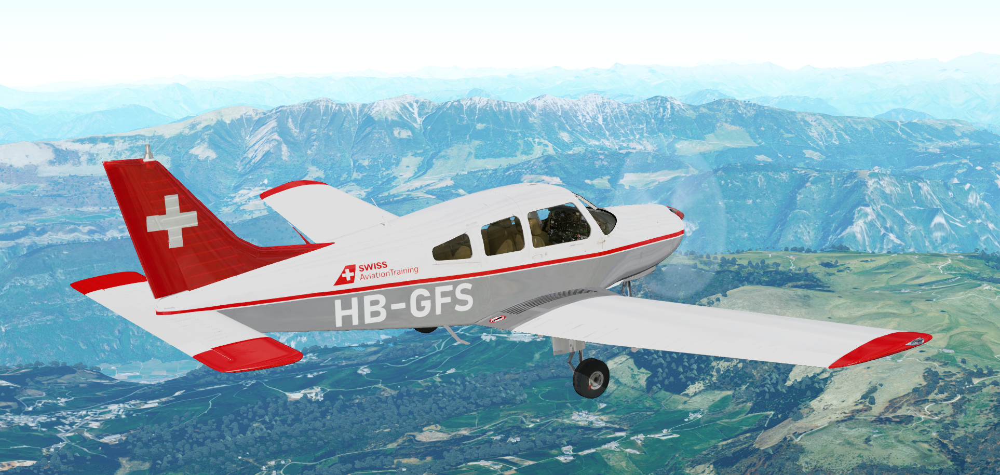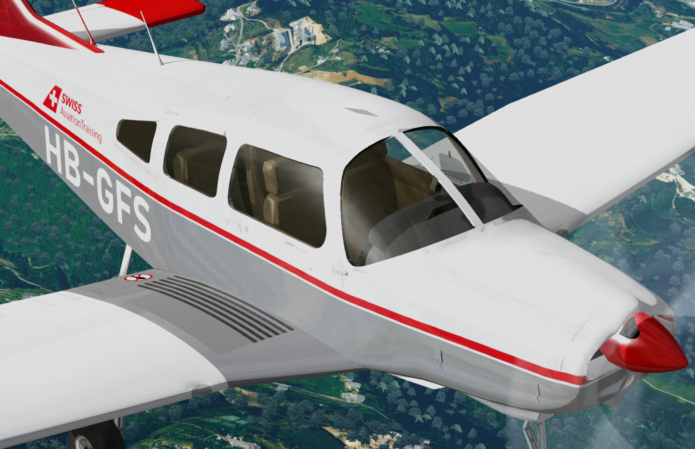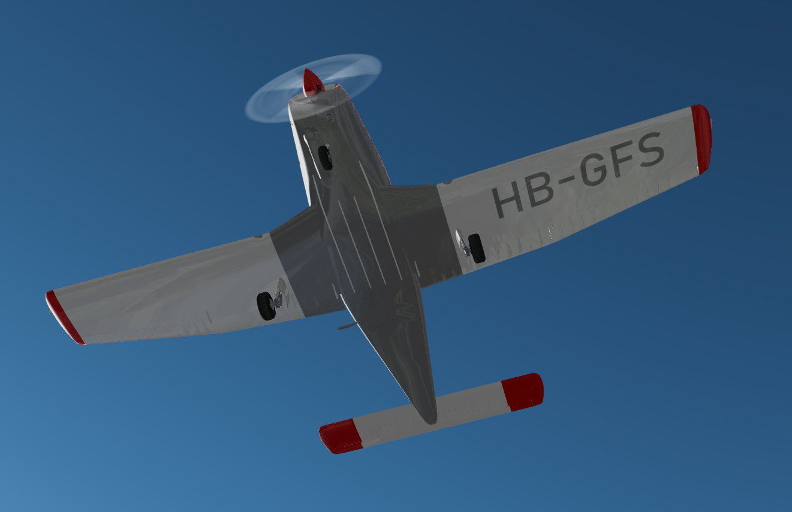

- Cheatline (Piper PA-28, [source](https://www.flyfinland.fi/index.php?page=searchresults&category=byregistration&registration=OH-PIA))  
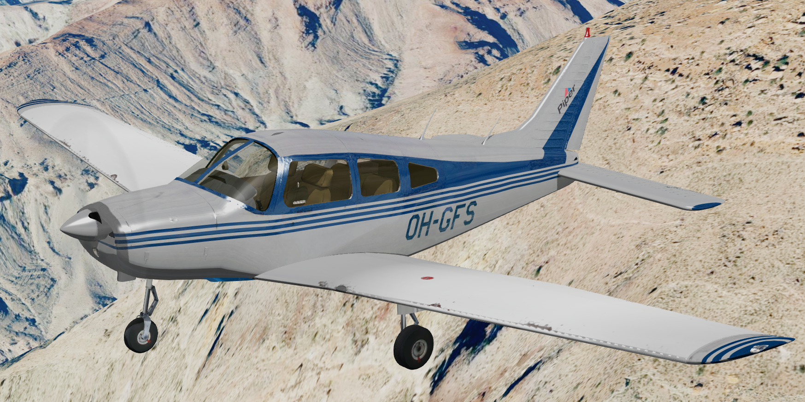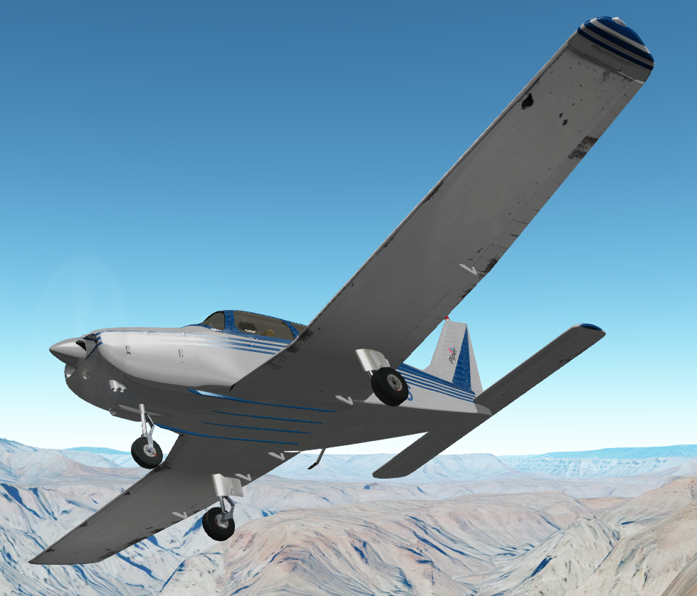

- Experimental Aviation Switzerland (Sonex-B kit, [source](https://www.experimental.ch/gallery/first-flights-2013/))  
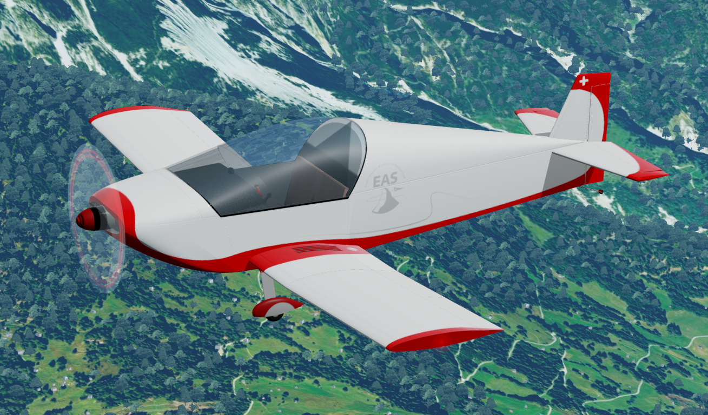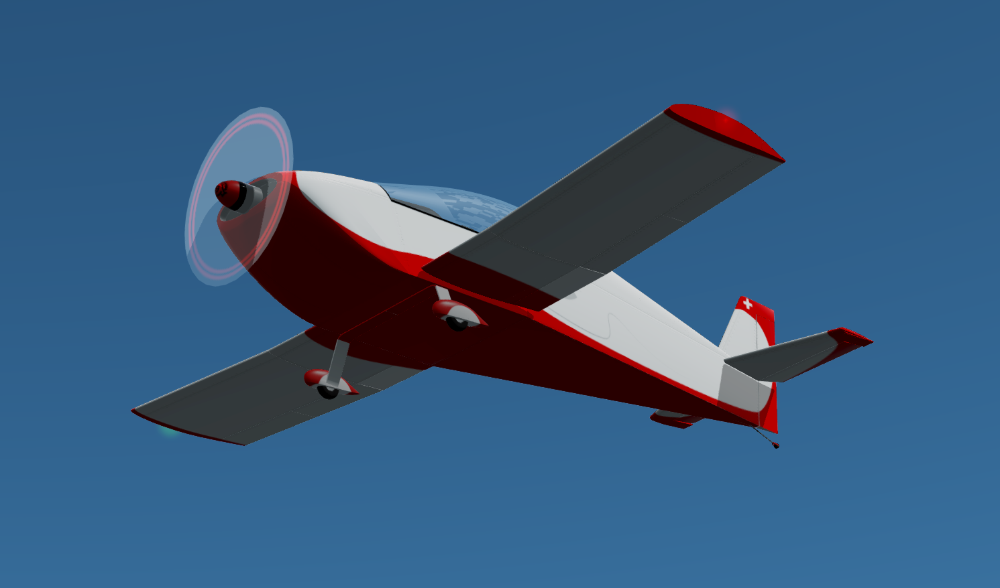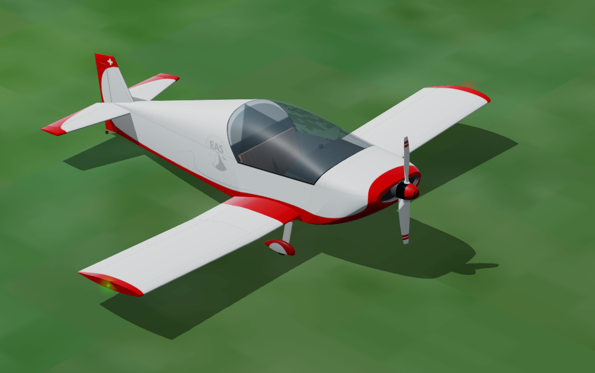

- Phenom 100 (MattGreen, DesertBeige, SwissAviation)  
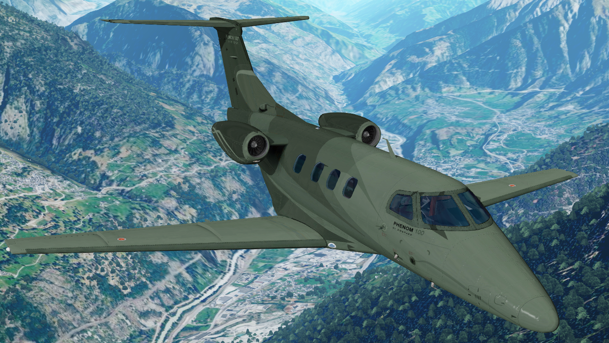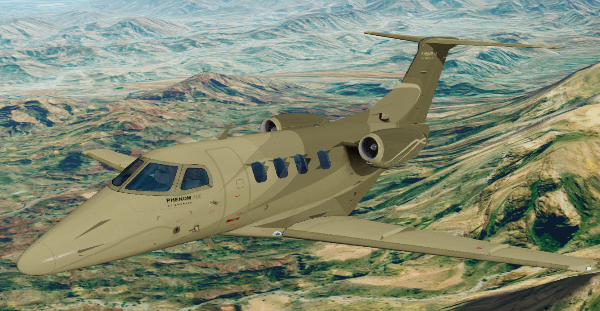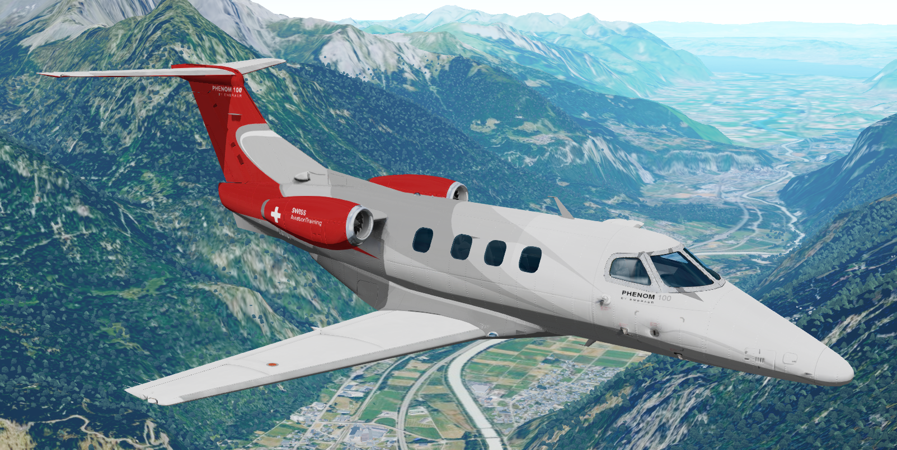
