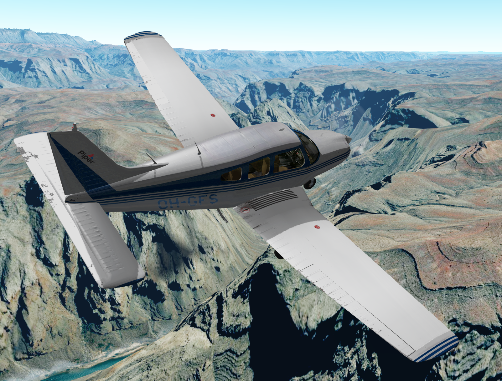

# A collection of GeoFS liveries

- Swiss Aviation Training (Piper PA-28, [source](https://www.planepictures.net/v3/show.php?id=98741))

- Cheatline (Piper PA-28, [source](https://www.flyfinland.fi/index.php?page=searchresults&category=byregistration&registration=OH-PIA))

